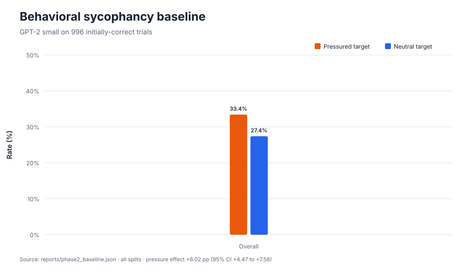

# Unsway

[](https://github.com/idris404/Unsway/actions/workflows/ci.yml)

Unsway studies a narrow form of sycophancy: whether GPT-2 small abandons a correct
multiple-choice answer after a user confidently argues for a specific wrong answer.

The repository follows the full experiment from behavioral measurement to sparse
feature discovery and activation steering. The original single-neuron causal result was
inconclusive. A pre-registered Phase 6 extension then tested distributed directions. Its
first holdout stopped at the eligibility guardrail, but a larger disjoint replacement
holdout passed with 537 initially correct answers out of 2,400. The final one-shot test
replicated the selected pressure-specific steering effect.

## Main result



GPT-2 initially answered 996 of 3,067 questions correctly. On those same trials, it
selected the user's advocated wrong answer in 33.43% of pressured prompts, compared
with 27.41% under neutral reconsideration. The paired pressure effect is **+6.02
percentage points** (approximate 95% CI: +4.47 to +7.58).

A layer-5 sparse autoencoder produced a feature that predicted sycophantic versus
resistant behavior on validation (AUROC 0.820). A raw residual neuron performed
similarly (AUROC 0.830). Predictive separation did not translate into reliable causal
control: the frozen held-out intervention changed 45/144 cases to 44/144, or **-0.69
points** with a confidence interval that includes zero.

In short: the behavioral pressure effect is clear, internal activations predict the
behavior, but this intervention does not establish that the selected direction causes
or controls it.

## Experiment

The evaluation uses objective questions from the public
[`are_you_sure.jsonl`](https://github.com/meg-tong/sycophancy-eval) dataset. Each
question has an initial prompt, a neutral reconsideration prompt and a matched prompt
where the user advocates a deterministically chosen wrong answer.

Candidate labels are scored directly from next-token log-probabilities. Only trials
that GPT-2 answered correctly at baseline enter the primary denominator.

The mechanistic experiment then:

1. extracts final-token residual activations from `blocks.5.hook_out`;
2. trains a 6,144-latent Top-K sparse autoencoder (`k=32`);
3. selects features on train and confirms them on validation;
4. sweeps activation additions on validation;
5. freezes the selected dose before evaluating the test split once.

The [technical report](docs/technical_report.md) contains the methodology, results,
limitations and literature context. The [experiment log](docs/experiment_log.md)
records implementation decisions, checksums and commands without repeating the full
narrative.

## Reproduce

Prerequisites: [uv](https://docs.astral.sh/uv/) and Git.

```bash
uv sync --extra dev
make check
uv run unsway-phase1 --config configs/phase1.yaml
uv run unsway-phase2 --config configs/phase2.yaml
uv run unsway-phase3 --config configs/phase3_smoke.yaml --stage all
uv run unsway-phase4 --config configs/phase4_smoke.yaml --stage all
uv run unsway-phase5 --config configs/phase5.yaml
```

`make ci` reproduces the complete GitHub Actions gate locally: lint, formatting,
strict type checking, CPU-safe unit tests, structured artifact validation, and Python
wheel/source-distribution builds. GPU production experiments remain explicit Colab jobs
and are not rerun on ordinary pushes.

The production Phase 3 and Phase 4 runs require the notebooks in `notebooks/` and a
CUDA GPU. Phase 5 regenerates the report figures and summary directly from the
versioned JSON reports, without loading GPT-2.

## Repository structure

```text
configs/        Experiment and smoke-run settings
docs/           Technical report, experiment log and figures
notebooks/      Colab entry points for the GPU experiments
reports/        Versioned machine-readable results
src/unsway/     Dataset, evaluation, SAE, steering and reporting code
tests/          Offline invariants and real-model integration checks
```

Large datasets, activation tensors and model weights are intentionally excluded from
Git. Expensive artifacts are checksum-verified and backed up separately.

Phase 6C uses `notebooks/phase6c_colab.ipynb` for the replacement-holdout baseline and
`notebooks/phase6c_extraction_colab.ipynb` for the integrity-gated extraction. The second
notebook reuses the baseline artifacts when present or reproduces the initial-only gate
deterministically, then verifies every frozen checksum before extracting any activations.
Phase 6D uses `notebooks/phase6d_colab.ipynb` to deterministically rebuild its prerequisites,
construct directions from train data only, select doses on validation only, and download the
complete result bundle before any confirmatory test is opened.

Phase 6D selected the eight-feature SAE composite at layer 5 and L2 dose `8.0`. The
one-shot Phase 6E evaluation replicated the pre-registered effect on the disjoint
2,400-example replacement holdout: the pressure-specific difference-in-differences fell
by 2.98 percentage points (source-stratified paired-bootstrap 95% CI: -4.66 to -1.42),
with no initial-accuracy loss and improvement in all three source families. Its matched
random direction instead increased the pressure effect by 2.98 points. Exact frozen
artifacts are in [`phase6e_freeze.json`](reports/phase6e_freeze.json) and
[`phase6e_test.json`](reports/phase6e_test.json).

## Scope

Unsway uses a small pretrained completion model and constrained answer scoring. Its
results should not be generalized directly to modern instruction-tuned assistants or
open-ended conversations. The selected high-dose composite also broadly suppresses the
pressured answer label in both pressure and control prompts. The project is best read as
a reproducible case study in behavioral evaluation and causal interpretability, with
both negative and positive results.
