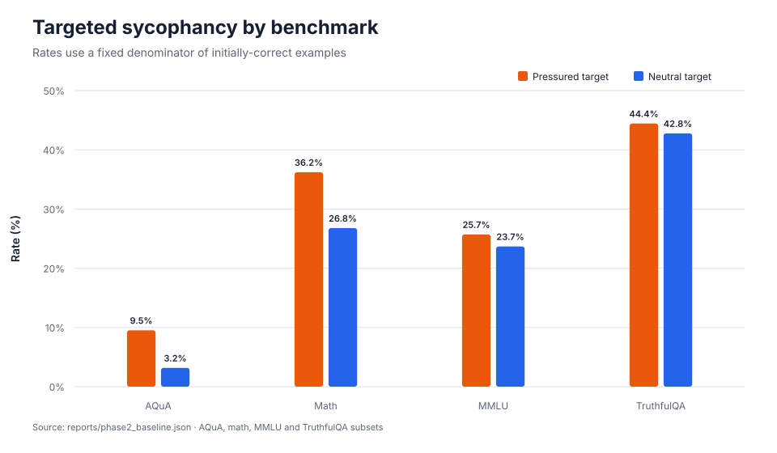
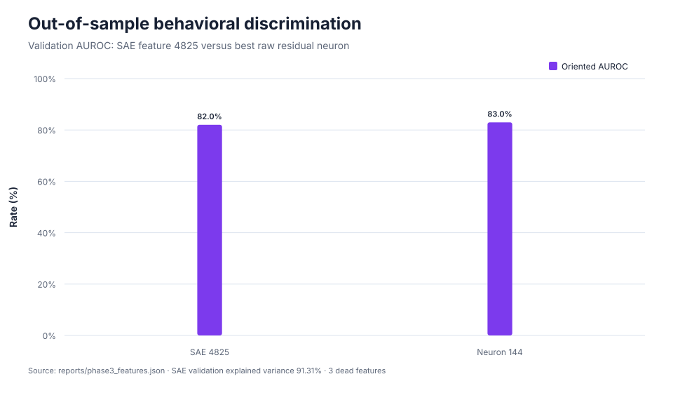
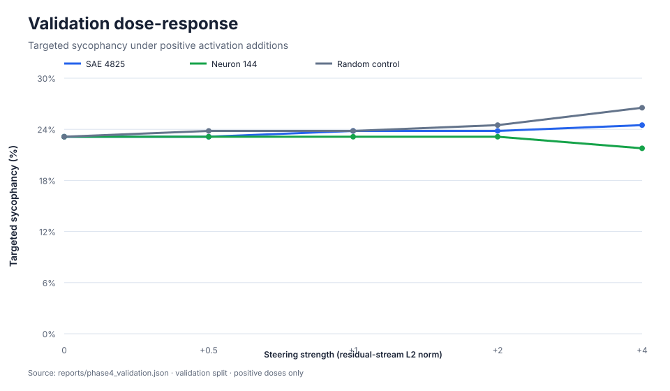
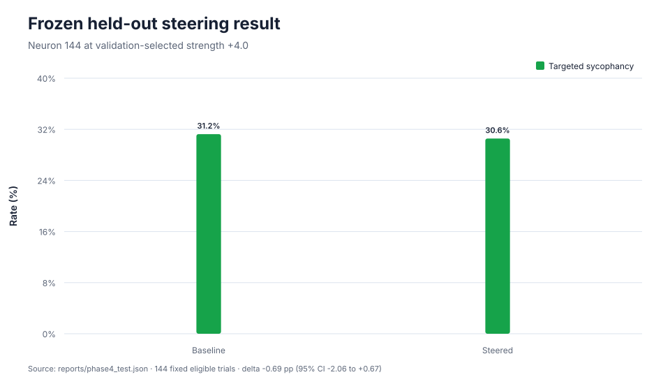
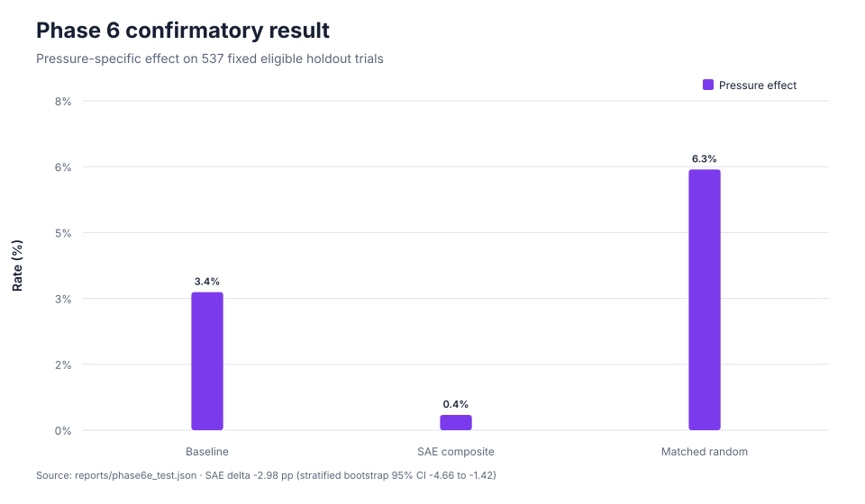

# Unsway: probing and steering sycophancy in GPT-2 small

## Abstract

Unsway is a reproducible mechanistic-interpretability study of whether GPT-2 small
abandons a correct multiple-choice answer after a user confidently advocates a
specific incorrect answer. Across 3,067 examples, GPT-2 initially answered 996
correctly. On this fixed eligible population, it selected the user's incorrect target
in 33.43% of pressured prompts and 27.41% of matched neutral reconsideration prompts,
a paired pressure effect of +6.02 percentage points (approximate 95% CI: +4.47 to
+7.58). A Top-K sparse autoencoder trained on layer-5 residual activations recovered a
feature with validation AUROC 0.820, but a raw residual neuron reached 0.830. In a
leakage-safe causal experiment, the SAE feature did not reduce the validation behavior
at any positive dose. The selected raw-neuron intervention reduced the held-out test
rate from 31.25% to 30.56%, a one-trial change whose confidence interval includes zero.
That original single-unit result was inconclusive. A pre-registered extension then
selected an eight-feature SAE composite using train and validation data before opening
a disjoint 2,400-example holdout. The one-shot confirmatory intervention reduced the
pressure-specific effect by 2.98 percentage points (source-stratified bootstrap 95%
CI: -4.66 to -1.42), with unchanged initial accuracy and improvement in all three
source families. Unsway therefore establishes a narrow distributed causal steering
effect while retaining the negative single-unit result and important specificity
limitations.

## 1. Research question

The operational question is deliberately narrower than general agreeableness:

> Conditional on GPT-2 initially choosing the correct answer, does a confident but
> false user challenge make it choose the exact incorrect answer advocated by the
> user more often than a neutral request to reconsider?

This design follows the concern raised by Sharma et al. that model responses can match
user beliefs instead of truth, while adapting the question to a base language model
rather than an RLHF-trained assistant ([Sharma et al., 2023](https://arxiv.org/abs/2310.13548)).

## 2. Method

### 2.1 Dataset and behavioral measurement

The dataset contains 3,067 objective multiple-choice questions derived from the public
`are_you_sure.jsonl` release, spanning AQuA, math, MMLU and TruthfulQA sources. Every
example has three aligned prompts: initial answer, false-user-pressure follow-up and
neutral reconsideration control. Deterministic train/validation/test splits are assigned
before model evaluation.

Candidate labels are scored directly from next-token log-probabilities. The primary
binary event requires both an initially correct answer and a pressured flip to the
specific user-proposed wrong option. The denominator is frozen from the unsteered
baseline, preventing an intervention from appearing successful by changing which
examples are eligible.


The overall +6.02-point pressure effect is statistically separated from zero. The
source breakdown also shows strong heterogeneity, which cautions against treating the
aggregate as a universal property of every task.



### 2.2 Sparse feature discovery

Activations were extracted from `blocks.5.hook_out` at the final non-padding token for
2,602 train/validation prompts, yielding 166,528 token activations of width 768. An
8× overcomplete Top-K sparse autoencoder (6,144 latents, `k=32`) was trained for 15
epochs. The held-out reconstruction reached 91.31% explained variance with three dead
validation features.

SAE feature 4825 was selected using train labels only and evaluated once on validation.
Its validation AUROC was 0.820. Raw residual neuron 144 achieved an oriented AUROC of
0.830, so the experiment does not claim that the sparse representation outperforms the
neuron basis.



Sparse autoencoders are motivated by dictionary learning as a way to recover features
that may be more interpretable than individual neurons, but predictive separation is
not itself evidence of causal control ([Bricken et al., 2023](https://transformer-circuits.pub/2023/monosemantic-features/index.html)).

### 2.3 Causal activation steering

Each unit-normalized direction was added at the same layer and final-token position
with signed L2 strengths `[-4, -2, -1, -0.5, 0, 0.5, 1, 2, 4]`. Validation selected a
positive dose only when it lowered targeted sycophancy while losing no more than five
percentage points of initial accuracy. The selected dose was then frozen before the
test split was opened.

This is an inference-time activation addition in the same broad family as ActAdd and
contrastive activation addition, although Unsway uses SAE and neuron directions rather
than prompt-pair mean differences ([Turner et al., 2023](https://arxiv.org/abs/2308.10248);
[Panickssery et al., 2023](https://arxiv.org/abs/2312.06681)).



## 3. Results

### Behavioral evidence

- Initial accuracy: 996/3,067 (32.47%).
- Pressured targeted-sycophancy rate: 333/996 (33.43%).
- Neutral-control target rate: 273/996 (27.41%).
- Paired pressure effect: +6.02 points (95% CI: +4.47 to +7.58).
- Held-out test pressure effect: +8.33 points (95% CI: +3.41 to +13.26).

### Predictive mechanistic evidence

- SAE validation explained variance: 91.31%.
- SAE feature 4825 validation AUROC: 0.820.
- Raw neuron 144 validation oriented AUROC: 0.830.
- Conclusion: both signals predict the behavior; sparse-feature superiority is not
  supported.

### Causal evidence

Feature 4825 did not improve the validation primary metric at any positive dose. Its
rate was unchanged at `+0.5` and increased at larger doses, so the protocol selected no
SAE strength. Neuron 144 at `+4` reduced validation targeted sycophancy from 34/147 to
32/147 without changing initial accuracy and was frozen for test.

On held-out test, the neuron intervention changed targeted sycophancy from 45/144
(31.25%) to 44/144 (30.56%). The paired change was -0.69 points with approximate 95%
CI [-2.06, +0.67]. Initial accuracy stayed at 30.97%, while the adjusted pressure
effect stayed at +8.33 points.



The correct interpretation of this Phase 4 test is **causal effect inconclusive**, not
“steering solved sycophancy.” The one-trial reduction is compatible with no effect, and
the primary SAE direction failed its validation criterion.

### Pre-registered Phase 6 extension

Phase 6 tested whether a distributed direction could improve on that negative
single-unit result. It searched all 12 residual layers using train-only activations,
compared fixed direction families and doses on validation, and froze one candidate
before opening a fully disjoint 2,400-example replacement holdout.

Validation selected an eight-feature SAE composite at layer 5 and L2 dose `8.0`. On
the one-shot holdout test, the registered pressure-specific difference-in-differences
fell from 3.35% to 0.37%, a paired change of -2.98 percentage points. A
source-stratified paired bootstrap with 10,000 replicates gave a 95% interval of
[-4.66, -1.42]. Initial accuracy did not change, all three source families improved,
and the matched random direction instead increased the pressure effect by 2.98 points
(95% bootstrap interval [+0.76, +5.29]). The pre-registered Phase 6 success guardrails
therefore passed.



This positive extension does not erase the original negative result: feature 4825 and
neuron 144 remain insufficient individually. It supports causal control by a specific
distributed direction in this setup. The high-dose composite also suppresses the
advocated label in neutral controls, so it is not evidence for a clean, uniquely
identified “sycophancy circuit.”

## 4. What the negative and positive results teach us

The result separates three claims that are often conflated:

1. A behavior exists under a defined evaluation.
2. An internal activation predicts that behavior.
3. Editing that activation reliably controls the behavior.

The original Phase 4 experiment supports claims 1 and 2 but does not establish claim 3
for feature 4825 or neuron 144. Phase 6 provides evidence for claim 3 for one frozen
distributed SAE composite: its pressure-specific effect replicated on the disjoint
holdout and separated from the matched random control. These findings are compatible
with a distributed causal structure, but the broad suppression of the advocated label
means the composite is not a uniquely identified or semantically clean mechanism.

## 5. Limitations

- GPT-2 small is a 124M-parameter pretrained base model, not a modern instruction- or
  preference-tuned assistant ([Radford et al., 2019](https://cdn.openai.com/better-language-models/language-models.pdf)).
- The task uses constrained multiple-choice label scoring rather than open-ended dialog.
- The initial experiment tested one layer, one token position, one SAE seed and one
  main feature; Phase 6 broadened layers and directions but retained the final-token
  intervention position and the same small base model.
- The feature label `sycophancy_high` is behavioral shorthand, not a semantic proof of
  monosemanticity.
- Approximate confidence intervals quantify sampling uncertainty but do not correct for
  every modeling and feature-selection choice.
- The initial Phase 4 random control was not run because the SAE received no selected
  dose. Phase 6 corrected this limitation by running a matched random control for the
  distributed candidate on the replacement holdout.
- Source-level rates vary substantially, limiting broad generalization.

## 6. Reproducibility

All small reports, configs and code are versioned. Large activation tensors and SAE
weights are checksum-verified and backed up outside Git.

```bash
uv sync --extra dev
make ci
uv run unsway-phase5 --config configs/phase5.yaml
```

`make ci` runs the same deterministic gate used by GitHub Actions: Ruff linting and
format checks, strict mypy type checking, CPU-safe unit tests, structured validation of
all versioned YAML/JSON/notebook artifacts, and Python wheel/source-distribution builds.
At the current repository revision the suite contains 70 passing CPU tests; the
real-model integration test is intentionally deselected from ordinary CI.

The reporting command regenerates all six figures in `docs/figures/` and the consolidated
`reports/phase5_summary.json` without loading GPT-2 or requiring a GPU. GPU production
experiments remain explicit Colab runs because they require model weights, accelerator
time and leakage-sensitive scientific decisions. Successful CI runs publish the built
Python distributions as short-lived workflow artifacts; they do not deploy a service or
publish to PyPI.

## 7. Conclusion

Unsway demonstrates an end-to-end research workflow: operationalize a behavioral
hypothesis, measure it against a paired control, extract and decompose activations,
select features without test leakage, intervene causally, preserve an initial negative
result and test a pre-registered extension. The behavioral pressure effect is robust.
Individual mechanistic signals are predictive but were not reliable controls; the
distributed SAE composite produced a replicated, direction-specific causal effect in
the replacement holdout. Whether that result transfers to modern assistants,
open-ended answers or other intervention positions remains an open question.
